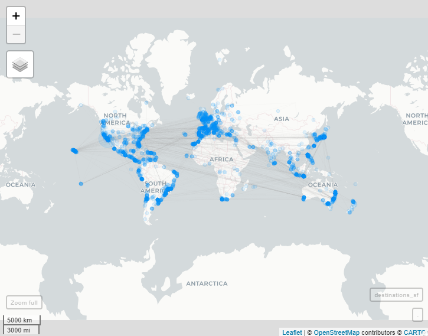
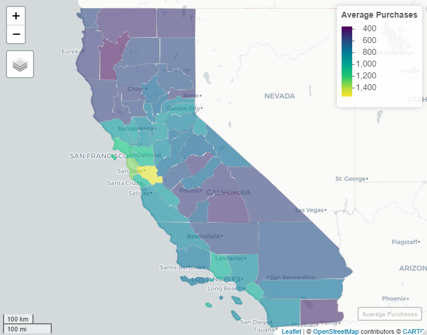
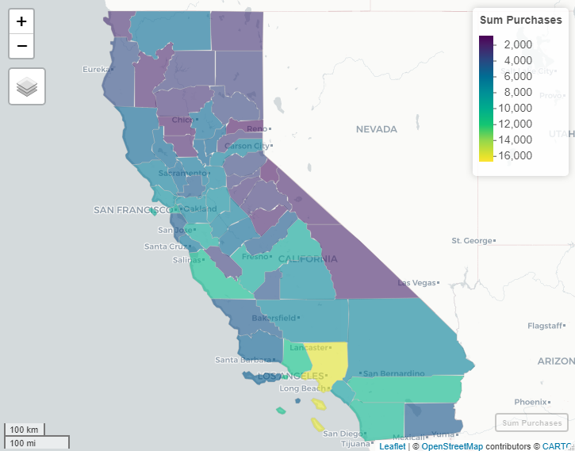

# Geospatial Analysis of Customer Sales

Utilizing geographical information to analyze sales for surfboards and other equipment for the sport. The following are a few visuals from the analysis. Since visualizations of the geospatial objects were created with sf / leaflet they are interactive by nature. As github has issues with html files, a few of the images were made to be static and then placed within static-files folder. All code is available within the r folder.

## Visuals from analysis

The following visuals depicts the volume of surfers for given geographical locations and their travel. The more opaque the circle the less the volume and vice versa. The lines from circles show the main travel destinations of the surfers.
 

 

The next visual shows California, segmented by its counties. This visual then has the viridis color palette applied top signify the aver sales of the surfboard equipment. Notice darker colors correlate to less sales than brighter colors.

 

 

Similar to the last visual, this  visual is depicting California. Expect in this case, it is analyzing the sum of sales within the counties.

 

 

The last visual is removing the counties and taking an approach of clustering the customers into groups. The colors in this visual only signify their groupings, but the size depicts higher volume of sales for that area.

 

